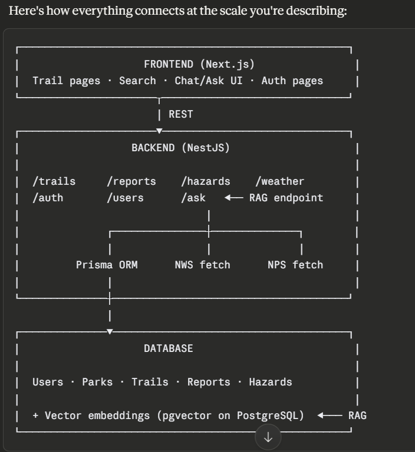

# TrailCheck

TrailCheck is a full-stack web app for exploring U.S. national park trails, checking current conditions, and reporting on-the-ground hazards. It combines a Next.js frontend, a NestJS API, a Prisma-backed SQLite database, and live park context from the National Park Service, weather data, and Gemini-powered condition summaries.



## What It Does

- Browse national parks and their trails from a single interface.
- View trail details, recent reports, hazard information, weather, and NPS alerts.
- Create an account, sign in, and submit trail condition reports.
- Generate park condition digests with retrieval-augmented AI responses grounded in live park context.

## Tech Stack

- Frontend: Next.js 16, React 19, TypeScript, Tailwind CSS 4
- Backend: NestJS 11, TypeScript
- Database: Prisma ORM with SQLite
- Auth: JWT + Passport
- External data: National Park Service alerts, weather forecast data
- AI: Google Gemini via `@google/genai`

## Repository Structure

```text
.
|-- frontend/trailcheck-web   # Next.js application
|-- backend/trailcheck-api    # NestJS API + Prisma schema/seed
`-- sys_design_w_RAG.png      # architecture diagram used above
```

## Core Features

### Frontend

- Landing page with a park explorer and featured national park visuals
- Park and trail detail pages
- Local auth session handling in the browser
- Report submission flow for signed-in users

### Backend

- `GET /parks` to list parks with attached trails
- `GET /trails` and `GET /trails/:id` for trail discovery and details
- `POST /auth/signup`, `POST /auth/signin`, and `GET /auth/me` for authentication
- `POST /reports` for authenticated trail report submission
- `POST /ai/ask` and `GET /ai/parks/:parkSlug/digest` for AI-assisted park condition summaries

## Local Setup

### 1. Install dependencies

```bash
cd backend/trailcheck-api
npm install

cd ../../frontend/trailcheck-web
npm install
```

### 2. Configure environment variables

Create a `.env` file in `backend/trailcheck-api`:

```env
DATABASE_URL="file:./dev.db"
JWT_SECRET="replace-with-a-secure-secret"
FRONTEND_ORIGIN="http://localhost:3000"
PORT=3001
NPS_API_KEY="your-nps-api-key"
GEMINI_API_KEY="your-gemini-api-key"
GEMINI_MODEL="gemini-2.5-flash"
```

Create a `.env.local` file in `frontend/trailcheck-web`:

```env
NEXT_PUBLIC_API_BASE_URL="http://localhost:3001"
```

Notes:

- `JWT_SECRET` is required for sign-up, sign-in, and authenticated report submission.
- `NPS_API_KEY` enables live National Park Service alerts.
- `GEMINI_API_KEY` enables Gemini-generated summaries. Without it, the backend falls back to a non-AI summary path.

### 3. Run database migrations and seed data

```bash
cd backend/trailcheck-api
npx prisma migrate dev
npx prisma db seed
```

### 4. Start the backend

```bash
cd backend/trailcheck-api
npm run start:dev
```

The API runs on `http://localhost:3001` by default.

### 5. Start the frontend

```bash
cd frontend/trailcheck-web
npm run dev
```

The web app runs on `http://localhost:3000`.

## Available Scripts

### Frontend

```bash
cd frontend/trailcheck-web
npm run dev
npm run build
npm run start
npm run lint
```

### Backend

```bash
cd backend/trailcheck-api
npm run start:dev
npm run build
npm run start:prod
npm run test
npm run test:e2e
npm run lint
```

## Data Model Overview

The Prisma schema currently centers on:

- `Park`
- `Trail`
- `Hazard`
- `TrailReport`
- `User`

This supports seeded park and trail data, user-submitted reports, and derived or external hazard context.

## Current Notes

- The repo contains starter/template READMEs inside the frontend and backend folders; the top-level `README.md` is the one GitHub displays on the repository main page.
- The backend database file at `backend/trailcheck-api/prisma/dev.db` is currently tracked and locally modified.

## Future Improvements

- Add screenshots or a short product demo GIF
- Document deployment steps for frontend and backend
- Add an API reference section with example request/response payloads
- Replace placeholder contact/footer content in the app with project ownership details
