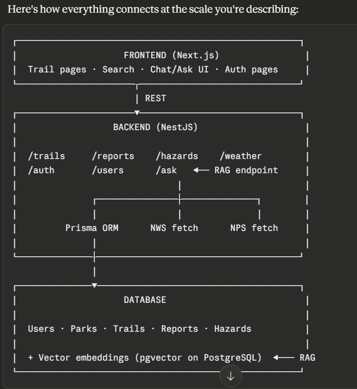

# TrailCheck

TrailCheck is a full-stack web app for exploring U.S. national park trails, checking current conditions, and reporting on-the-ground hazards. It combines a Next.js frontend, a NestJS API, Prisma with PostgreSQL, live National Park Service alerts, National Weather Service forecasts, and a three-step text generator.



## What It Does

- Browse national parks and their trails from a single interface.
- View trail details, recent reports, hazard information, weather, and NPS alerts.
- Create an account, sign in, and submit trail condition reports.
- Generate a park condition digest. The API fills the prompt with live NPS alerts, NWS forecast periods, and the in-process hazard rules. There is no vector index.

## Tech Stack

- Frontend: Next.js 16, React 19, TypeScript, Tailwind CSS 4
- Backend: NestJS 11, TypeScript
- Database: Prisma ORM with PostgreSQL
- Auth: JWT + Passport
- External data: National Park Service alerts, National Weather Service forecasts (`api.weather.gov`)
- AI chain: optional local QLoRA model, then DeepSeek, then a rules summary. See [Which AI path runs](#which-ai-path-runs).

## Repository Structure

```text
.
|-- frontend/trailcheck-web          # Next.js application
|-- backend/trailcheck-api           # NestJS API, Prisma schema, and ml/
|-- backend/trailcheck-api/ml        # rule-generated dataset, QLoRA config, eval
|-- docs                             # backend, frontend, and model notes
|-- compose.yaml                     # local PostgreSQL only
`-- sys_design_w_RAG.png             # architecture sketch; the runtime is not a vector RAG index
```

## Core Features

### Frontend

- Landing page with a park explorer and featured national park visuals
- Park and trail detail pages
- Local auth session handling in the browser
- Report submission flow for signed-in users

### Backend

- `GET /parks` to list parks with attached trails
- `GET /trails` and `GET /trails/:id` for trail discovery and details
- `POST /auth/signup`, `POST /auth/signin`, and `GET /auth/me` for authentication
- `POST /reports` for authenticated trail report submission
- `POST /ai/ask` and `GET /ai/parks/:parkSlug/digest` for AI-assisted park condition summaries

## Run locally on Windows

Run the API and the web app on your machine. Secrets stay in a gitignored env file. The frontend talks to `http://localhost:3001` in development without a frontend API key.

You need Node.js 22, npm, and either Docker Desktop or a native PostgreSQL 16 install.

### 1. Install dependencies

From the repo root in PowerShell:

```powershell
cd backend\trailcheck-api
npm install
cd ..\..\frontend\trailcheck-web
npm install
```

### 2. Create the backend env file

```powershell
cd backend\trailcheck-api
copy .env.example .env
```

Edit `backend\trailcheck-api\.env`. The API loads that file when you start it from `backend\trailcheck-api`. It also reads `backend\.env` if you put the same variables there. Both paths are gitignored. Commit `.env.example` only.

Set these for a working local API:

| Variable | Required | Purpose |
| --- | --- | --- |
| `DATABASE_URL` | yes | PostgreSQL connection string. The example matches the Docker database. |
| `JWT_SECRET` | yes | At least 32 random characters. |
| `FRONTEND_ORIGIN` | yes for local CORS | `http://localhost:3000` |
| `DEEPSEEK_API_KEY` | only for DeepSeek answers | Server-side DeepSeek key. Leave blank to use the rules summary. |
| `NPS_API_KEY` | only for live alerts | National Park Service alerts. Leave blank for an empty alert list. |

Optional variables have defaults when omitted:

| Variable | Default |
| --- | --- |
| `DEEPSEEK_MODEL` | `deepseek-flash` (DeepSeek V4.1 Flash) |
| `DEEPSEEK_DAILY_LIMIT` | `100` DeepSeek calls per UTC day, then rules. `0` disables DeepSeek. |
| `DEEPSEEK_MAX_OUTPUT_TOKENS` | `256`, and the server never sends more than `384` |
| `AI_RATE_LIMIT` | `20` AI requests per window, per IP or per signed-in user |
| `AI_RATE_LIMIT_TTL_SECONDS` | `60` |

Do not create a `NEXT_PUBLIC_` variable for `DEEPSEEK_API_KEY`. The browser never receives that key.

Leave `LOCAL_MODEL_ENABLED=false` unless you are running the Python model server and have a real adapter. Password reset email stays disabled until `PASSWORD_RESET_EMAIL_PROVIDER=resend` and `RESEND_API_KEY` are set in this same private file.

### 3. Start PostgreSQL

Docker Desktop:

```powershell
cd backend\trailcheck-api
npm run db:start
```

That runs `docker compose` against the repo `compose.yaml` and publishes Postgres on `localhost:5432`.

Native PostgreSQL instead of Docker:

1. Install PostgreSQL 16 and start the Windows service.
2. Create a database named `trailcheck`.
3. Set `DATABASE_URL` in `backend\trailcheck-api\.env` to that instance. The example user `postgres` / password `postgres` matches the Docker service; change it if your local install uses different credentials.

### 4. Migrate and seed

```powershell
cd backend\trailcheck-api
npx prisma migrate deploy
npx prisma db seed
```

`npm run db:setup` runs those two commands after the database is up.

### 5. Start the backend

```powershell
cd backend\trailcheck-api
npm run start:dev
```

The API listens on `http://localhost:3001`.

### 6. Start the frontend

```powershell
cd frontend\trailcheck-web
npm run dev
```

The web app listens on `http://localhost:3000` and calls `http://localhost:3001` in development even when `frontend\trailcheck-web\.env.local` does not exist. Copy `frontend\trailcheck-web\.env.example` to `.env.local` only if the API is on a different origin.

## Hosting history

The API previously ran on Render, and the web app could be deployed to Vercel. Render is no longer used. The supported setup is both apps on a local Windows machine.

Vercel remains optional for the frontend only. A Vercel deployment cannot reach an API bound to `localhost` on a laptop. Set `NEXT_PUBLIC_API_BASE_URL` on that deployment only when the API has a public origin the browser can call.

## Available Scripts

### Frontend

```bash
cd frontend/trailcheck-web
npm run dev
npm run build
npm run start
npm run lint
```

### Backend

```bash
cd backend/trailcheck-api
npm run start:dev
npm run build
npm run start:prod
npm run test
npm run test:e2e
npm run lint
```

## Data Model Overview

The Prisma schema currently centers on:

- `Park`
- `Trail`
- `Hazard`
- `TrailReport`
- `User`

This supports seeded park and trail data, user-submitted reports, and derived or external hazard context.

## Which AI path runs

`POST /ai/ask` and `GET /ai/parks/:parkSlug/digest` share one chain. The JSON field `generationSource` says which step wrote the text.

| Order | Source value | When it runs |
| --- | --- | --- |
| 1 | `local` | `LOCAL_MODEL_ENABLED` is not `false`, and the local server or Python subprocess returns schema-valid JSON. The default transport calls `http://127.0.0.1:8001`. That process must be started separately and needs a saved QLoRA adapter. |
| 2 | `deepseek` | The local step is skipped, missing, or invalid, and `DEEPSEEK_API_KEY` is set to a real key, and the UTC-day request cap has not been reached. The model id defaults to `deepseek-flash` (DeepSeek V4.1 Flash) at `https://api.deepseek.com`. |
| 3 | `fallback` | The local step did not produce valid JSON, and DeepSeek is unset, over the daily cap, or returns an error. The text comes from the hazard rules, NPS alerts, and the NWS forecast. |

Digest responses are cached in memory for the UTC day. The cache key is the park slug plus that park's trail slugs, so park pages and trail pages share one digest and do not call DeepSeek again until the next UTC day. `POST /ai/ask` and `GET /ai/parks/:parkSlug/digest` are also limited per signed-in user, or per IP when the request has no valid token.

This repository does not contain an adapter checkpoint. A normal local request therefore does not run Qwen unless you start the model server yourself. It uses DeepSeek when `DEEPSEEK_API_KEY` is set in the backend env file, and the rules summary otherwise. The response field `generationSource` is the check. The UI labels that value `DeepSeek`.

The training examples are rule-generated, not hand-written. See [Model training](#model-training).

## Model training

Code lives in `backend/trailcheck-api/ml/`.

- Labels are produced by `ml/data/build_dataset.py` from weather thresholds and NPS alert keywords.
- The full 2024 build recorded in commit `ae20b74` had 660 examples from Big Bend and Yosemite (560 train / 100 validation). Those JSONL files are not in git. 660 is a split count, not a model score.
- `ml/configs/trailcheck_qlora_4060.yaml` is a 4-bit QLoRA config for `Qwen/Qwen2.5-3B-Instruct` aimed at one RTX 4060-class GPU.
- No adapter is committed. A training run was reported finished on that GPU, but the artifacts were lost. `ml/results/model_eval.json` says `not yet run`.
- `ml/results/harness_smoke.json`, when present, scores a replay of the rule labels on the tiny fixture. It does not score Qwen.

CPU smoke test, from `backend/trailcheck-api` after `pip install -r ml/requirements-smoke.txt`:

```bash
python -m unittest discover -s ml/tests -v
```

That builds the fixture dataset, checks JSON-valid rate and risk accuracy for the rules replay, and refuses to invent model metrics.

GPU training, after installing a CUDA PyTorch wheel and `ml/requirements.txt`, and after rebuilding the processed CSVs the 4060 config points at:

```bash
python ml/data/build_dataset.py --config ml/configs/trailcheck_qlora_4060.yaml
python ml/training/train_sft.py --config ml/configs/trailcheck_qlora_4060.yaml
python ml/inference/generate_local.py \
  --config ml/configs/trailcheck_qlora_4060.yaml \
  --adapter-path ml/models/trailcheck-qwen25-3b-json \
  --dataset-file ml/data/outputs/validation.jsonl \
  --output-file ml/data/outputs/local_predictions.jsonl
python ml/evaluation/evaluate_outputs.py \
  --gold ml/data/outputs/validation.jsonl \
  --predictions local=ml/data/outputs/local_predictions.jsonl \
  --output ml/results/model_eval.json
```

Replace the placeholder `model_eval.json` with that report only after the command prints real metrics. The processed 2024 CSVs are gitignored and are not in a fresh clone, so the 660-row build has to be reconstructed from the scripts in `backend/trailcheck-api/scripts/` before the GPU command above can see them.

## Current Notes

- The top-level `README.md` is the one GitHub shows. Nested READMEs are narrower.
- The local database is PostgreSQL. `compose.yaml` starts it, or you can use a native Windows install.
- Do not describe the SFT set as hand-built, and do not quote model accuracy until `model_eval.json` is replaced with a real run.
- Do not commit `.env` files. `DEEPSEEK_API_KEY` is read only by the NestJS process.

## Production-mode checks

These apply when `NODE_ENV=production`. Local `npm run start:dev` does not require them.

- The backend validates required env vars on boot and refuses a JWT secret shorter than 32 characters.
- Production startup refuses a non-PostgreSQL `DATABASE_URL`.
- Password reset email provider credentials are validated only when email delivery is explicitly enabled.
- CORS is restricted to `FRONTEND_ORIGIN`, Helmet headers are enabled, and request throttling is turned on globally.
- `GET /health` reports process and database status.

## Future Improvements

- Add screenshots or a short product demo GIF
- Keep the Windows local setup notes current when the API commands change
- Add an API reference section with example request/response payloads
- Replace placeholder contact/footer content in the app with project ownership details
