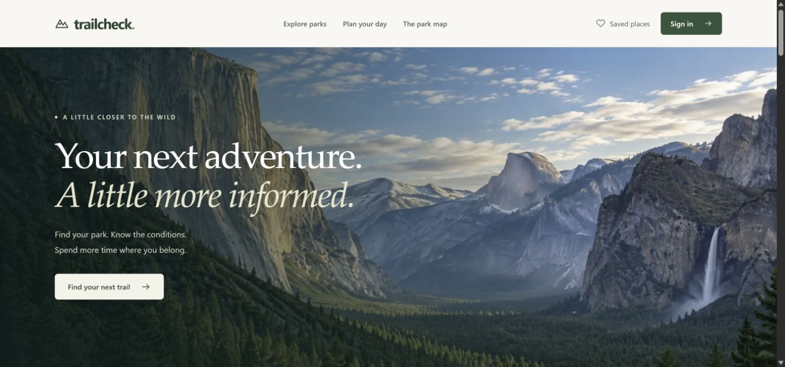
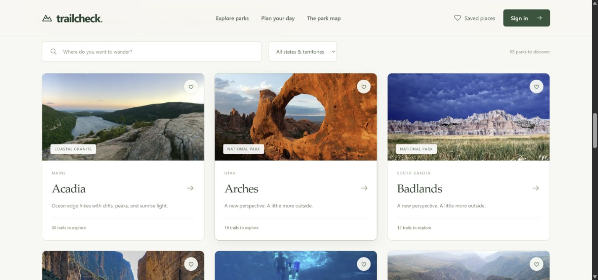

# TrailCheck UI overhaul and bug log

The application now uses an outdoor editorial design: warm ivory surfaces, forest-green accents, serif display type, spacious navigation, and authentic national park photography. The redesign covers discovery, search and filters, park and trail details, safety digests, account dialogs, saved lists, reports, recovery pages, photo credits, and responsive layouts.

The scenic Yosemite hero uses the same built-in ImageGen workflow used for Tri-Realm Eco. It is labeled as inspired AI scenery. All 63 park photographs are credited NPS images, bundled locally as WebP rather than requested from third-party thumbnail services at runtime. One NPS photograph is obtained from its public-domain Wikimedia mirror. See `hero-prompt.md`, the photo acquisition scripts, and `/photo-credits` for provenance.

## Issues created before their fixes

| Issue | Fix | Verification |
| --- | --- | --- |
| [#38](https://github.com/its-arnavtech/TrailCheck/issues/38) | Use local, park-specific photographs and honest fallback labels. | Every catalogue slug resolves to an existing asset; source credits preserved. |
| [#39](https://github.com/its-arnavtech/TrailCheck/issues/39) | Native modal dialogs with focus containment, Escape, backdrop dismissal, scroll locking, accessible names, and focus restoration. Add a working skip link. | Browser keyboard/focus checks and mobile dialog review. |
| [#40](https://github.com/its-arnavtech/TrailCheck/issues/40) | Public authentication failures retain the API's credential error. | Public sign-in 401 regression. |
| [#41](https://github.com/its-arnavtech/TrailCheck/issues/41) | Scope saved-park caches and in-flight results to the current token and cache generation. Ignore stale component loads. | Account switch and invalidation race regressions. |
| [#42](https://github.com/its-arnavtech/TrailCheck/issues/42) | Disable caching for trail responses containing reports so router refresh retrieves fresh data. | Request-cache regression. |
| [#43](https://github.com/its-arnavtech/TrailCheck/issues/43) | Associate report labels with controls; name each rating button and expose its selected state. Improve account/reset input names. | Mobile surface/rating controls and accessible DOM review. |
| [#44](https://github.com/its-arnavtech/TrailCheck/issues/44) | Show unknown risk when data is absent; preserve the highest known severity. Distinguish seasonal context from unavailable live feeds. | Missing digest, missing feeds, and severity ordering regressions. |
| [#45](https://github.com/its-arnavtech/TrailCheck/issues/45) | Deduplicate account checks and reject stale results after logout/account switch. Bind every protected 401 to its original token. | Logout/account-switch races and late 401s for profile, preferences, updates and reports. |
| [#46](https://github.com/its-arnavtech/TrailCheck/issues/46) | Upgrade Next.js, its lint configuration, Vitest, MapLibre, and vulnerable transitive dependencies. | Frontend audit: 0 vulnerabilities; lint, typecheck, production build. |
| [#47](https://github.com/its-arnavtech/TrailCheck/issues/47) | Update backend middleware/tooling dependencies and override the vulnerable deepmerge-ts version. | Backend audit: 0 vulnerabilities; Prisma generation, build and tests. |
| [#48](https://github.com/its-arnavtech/TrailCheck/issues/48) | Query active hazards only; identify unavailable database, alert and weather feeds separately. | Four trail-service regressions; offline trail UI review. |
| [#49](https://github.com/its-arnavtech/TrailCheck/issues/49) | Normalize state names for older databases; fix Yellowstone's seed data. | API regressions and Wyoming filter includes Yellowstone and Grand Teton. |
| [#50](https://github.com/its-arnavtech/TrailCheck/issues/50) | Add accessible region selectors for all 63 map locations. | Region switching and Alaska/Hawaii/territory marker review. |
| [#51](https://github.com/its-arnavtech/TrailCheck/issues/51) | Constrain grid tracks and child minimum widths so maps/reports stay inside phone viewports. | 390px park, trail and homepage checks: no horizontal overflow. |

Issues remain open until the fixing PR is merged, so the issue log and review remain connected.

## Validation

- Frontend: 28 tests pass; ESLint and TypeScript pass; fresh production build succeeds.
- Backend: 65 unit tests and 2 end-to-end tests pass; TypeScript build succeeds; lint has no errors. The existing 98 warnings remain outside this change; new trail tests lint cleanly.
- Python: 15 existing dataset, evaluator, smoke-pipeline and structured-output validation tests pass in a local virtual environment using `ml/requirements-smoke.txt`.
- Both full npm audits report zero vulnerabilities, including development dependencies.
- Repository secret scan and `git diff --check` pass.
- Browser review includes desktop/mobile layout, image loading, directory filtering, map regions, modal keyboard behavior, menu navigation, and report controls. See `screenshots/`.

A clean production build was used for the final browser review after clearing stale local Next.js build artifacts.

## Design preview

Phone screenshots of the homepage, park detail and report form are also saved in `screenshots/`.

## Local preview and limits

The preview runs at `http://localhost:3000`, with the API at `http://localhost:3001`. This workspace has no PostgreSQL server or configured NPS/model credentials, so the preview uses the existing static catalogue and clearly identifies unavailable condition feeds. Authenticated database writes (signup, saved parks and report submission) have unit coverage but were not exercised against a live database here. End-to-end tests covered API startup and health in degraded mode. No model training or external deployment was performed.

To run locally, configure the documented environment and database, then run the backend and frontend normally. CPU model tests use `.venv/Scripts/python.exe -m unittest discover -s ml/tests -v` from the backend directory.
